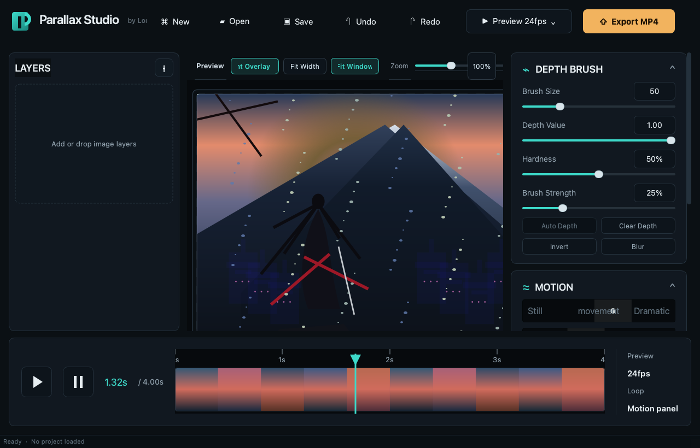

# Parallax Studio

Parallax Studio is a local macOS tool for turning layered artwork into looping 2.5D parallax animations.

It is designed for visual novel art, scene illustrations, character cutouts, and any workflow where you want motion from static layers without moving into a full compositing suite.



## What it does

- Import multiple image layers from PNG, JPG, JPEG, or WebP files.
- Paint depth maps per layer with brush size, hardness, opacity, and depth value controls.
- Move and scale layers directly on the canvas.
- Preview motion live at 24 fps.
- Export to MP4 or GIF.
- Save projects as `.parlx` files that keep layer order, settings, and depth data.

## MacOS first

This project targets **macOS Apple Silicon** first.

The app is built locally with:

- Python 3.11+
- PySide6
- NumPy
- OpenCV
- imageio
- Pillow

## Quick start

```bash
python3 -m venv .venv
source .venv/bin/activate
pip install -r requirements.txt
python main.py
```

## Build a local app bundle

```bash
chmod +x build_macos.sh
./build_macos.sh
```

That produces:

- `dist/Parallax Studio.app`
- `dist/Parallax Studio.dmg`

## Project format

`.parlx` is a JSON project file. It stores:

- layer order
- source image paths
- visibility
- opacity and intensity
- layer transforms
- motion settings
- compressed depth maps

Source images are referenced by path instead of being embedded. If a source file moves, the app can still open the project and show a missing-file placeholder instead of crashing.

## Public site

The GitHub Pages landing page lives in `docs/`.

## License

No license has been published yet.
